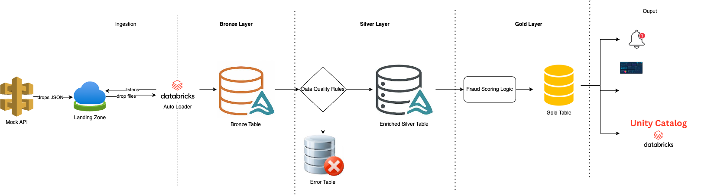
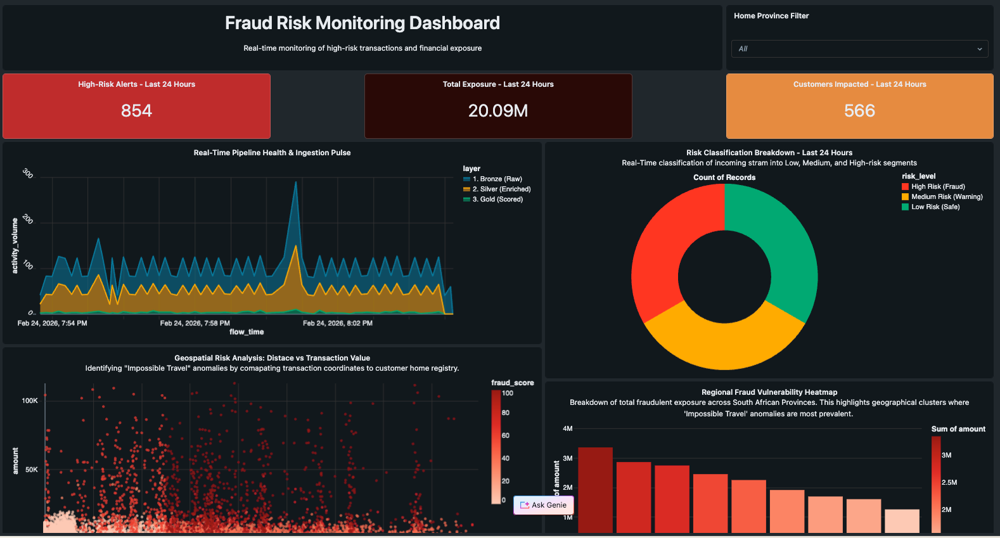
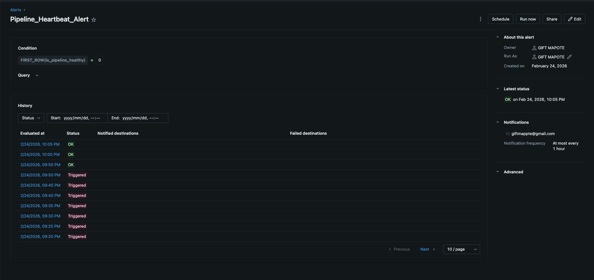
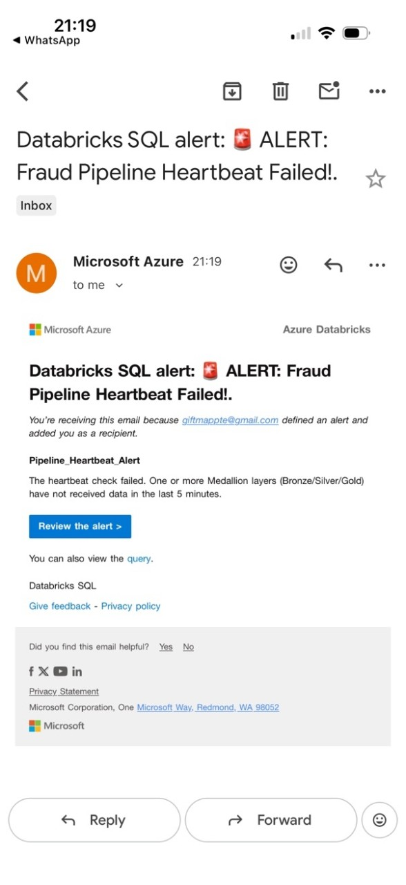
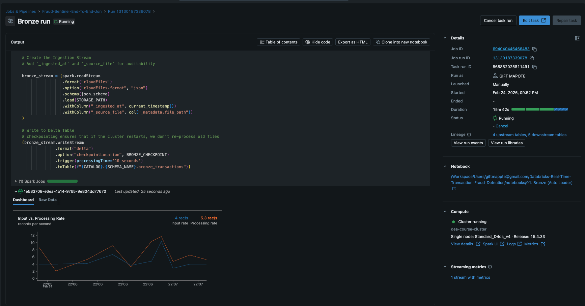
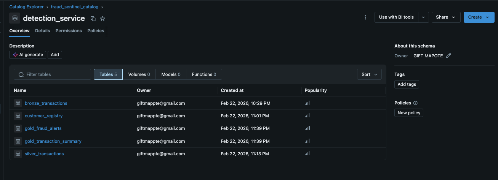
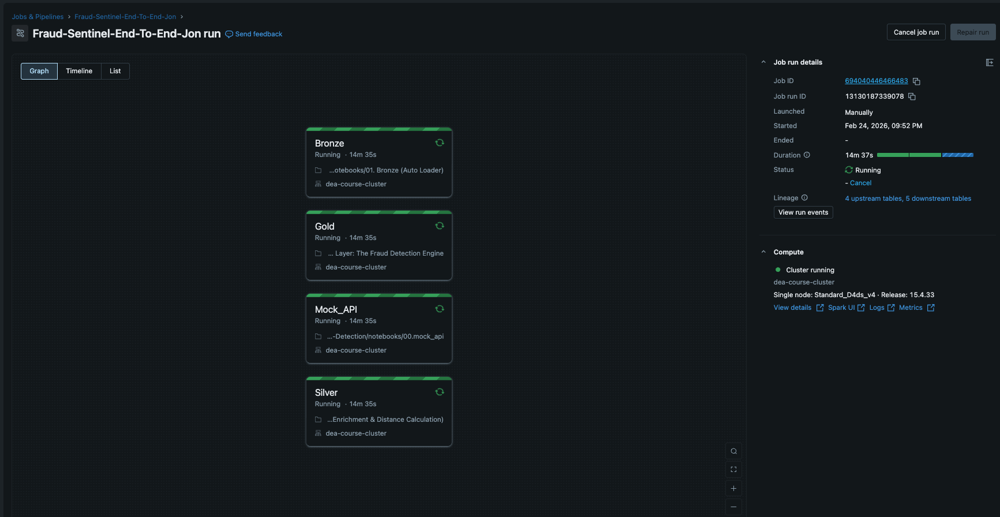

# Databricks-Real-Time-Transaction-Fraud-Detection
The project is about proactively stopping fraudulent banking transactions in real-time instead of reporting back on fraud cases that took place. The projects detects and reports the transaction in real time.

## 1. Executive Summary
This project simulates a high-velocity banking environment for **1,000 customers**, shifting fraud detection from "Retroactive Reporting" to **"Proactive Prevention."** By leveraging the Medallion Architecture and Stateful Streaming, the system identifies "Impossible Travel" anomalies and high-risk transactions in sub-10 second intervals.

## 2. Busines Problem Statement
Legacy banking systems often rely on batch processing, leading to significant **detection latency (6+ hours)**. This system addresses that gap by implementing a **sub-second real-time architecture**, allowing the institution to block fraudulent transfers before funds are moved. 

## 3. Solution and How
The solution is a **Real-Tine Fraud Engine** built on the Databricks Lakehouse. 
* **The "How":** Ingest raw JSON transactions data and join it with a static **Customer Dimension** table.
* **The Logic:** I use **Haveraine Formula** to calculate the distance between a customer's registered home address and the current transaction location. If the distance and amount exceed specific thresholds, a **Fraud Score** is generated, and a **SQL Alert** is triggered instantly.

## 4. Architecture Design
### 4.1 Medallion Architecture
This project follows the **Medallion Architecture** to ensure a governed and auditable data flow:

* **Bronze(Raw)**: Continous ingestion of synthetic API events via **Databricks Auto Loader** with schema evolution.
* **Silver(Enrinched)**: High Integrity data cleansing using **Delta Live Tables (DLT) Expectations** to quarantine malformed or suspicious records.
* **Gold(Behavioral)**: Business-level aggregates used for the **Excecutive Dashboard** and **SQL Alerts**

**Pipeline Orchestration:** > The system is fully automated via a Databricks Workflow. It begins with a Python-based Mock API (Data Generation), followed by an Auto Loader ingestion task (Bronze), and concludes with a Structured Streaming enrichment task (Silver/Gold) that utilizes stateful checkpoints for recovery.

### 4.2. Live Dashboard
The **FraudSentinel Dashboard** serves at the primary "Missing Control" for the real-time detection ecosystem. It is engineered to provide high-fedility visibility into the health of the Medallion architecture, ensuring that data is moving from raw injestion to actionable fraud alerts within seconds. 

### 4.3 Pipeline Health & Automated Alerting
A silent pipeline is the most dangerous failure in Data Engineering. To prevent this, **FraudSentinel** utilizes an automated `Heatbeat` monitoring system that checks for data staleness across all Medallion layers.
#### The Monitoring Logic
The system doesn't just check if the tables exist, it calculates the **Time Since Last Record** in seconds. If the gap between the current timestamp and the latest record exceeds **300 seconds (5 minutes)**, the hearbeat is considered `lost`.
#### Business Resilience
By moving from `Reactive` to `Proactive` monitoring, this system ensures a **99.9% Data Availability SLA**. It eliminates the risk of `missing fraud` due to undetectd pipeline outages, protecting the business from financial exposure during downtime. 

### Trigger Alert

### Example of Alert

### 4.4 Automated Housekeeping
In a Delta Lake environment, every update and delete creates new files while keeping the old ones for "Time Travel" capabilities. Without management, this leads to **"Cloud Bloat"**- increased storage costs and slower query performance.
#### The Cleanup Strategy
To keep the **FraudSentinel** ecosystem lean and performant, I implemented an automated maintance routine using the `VACUUM` command. This ensures that the system only retains what is necessary for recovery while purging techinical debt.
#### Key Features:
* **7-Day Retention Policy**: By setting `RETAIN 168 HOURS`, the system balances storage savings with safety, allowing for data recovery and "Time Travel" for up to one week.
* **Orchestrated Scheduling:** This isn't a manual task. It is handled via a **Databricks Workflow Job** that runs on a weekly cron schedule.
* **Multi-Layer Purge:** The job scans the entire Medallion architecture (Bronze, Silve, Gold) to ensure no stale files are left behind in any schema.
#### Business & Performance Impact:
* **Cost Reduction:** Minimizes S3/Azure Blob storage costs by deleting gigabytes of unreferenced parquet files.

* **Query Acceleration:** By reducing the number of files the SQL Warehouse has to "scan," dashboard refresh times remain consistent and fast.

* **Operational Maturity:** Demonstrates a "Production-First" mindset by managing the data lifecycle from birth to archive.
## 5. Tech Stack Decision

| Component | Choice | Rationable (The "why"|
|----------|----------|---------|
| **Ingestion**  | **Auto Loader**  | Chosen for efficient, incremental file discovery without manual schema management.  |
| **Processing**   | **PySpark**   |  Used for its horizontal scalability and robust support for stateful streaming.  |
| **Governance** | **Unity Catalog** | Implements fine-grained access control and end-to-end data lineage for audit compliance. |
| **DevOps** | **GitHub Actions** | Integrated for automated CI/CD, demonstrating production-read engineering practices. |
| **Storage** | **Delta Lake** | Provide ACID transactions and "Tinme Travel" for financial auditing. |
| **Governance** | **Unity Catalog** | Centralized access control for sensitive customer dimension data. |

## 6. Data Generation & API Simulation
To simulate a live production environment, we used the dbldatagen framework to mock a 1,000-customer registry.

* **Behavioral Injection:** We programmatically inject fraudulent patterns (10% of total volume) where transaction coordinates are physically impossible to reach from the customer's home in the given time.

* **Volume:** Configured to push thousands of records to test the Spark engine's horizontal scalability

## 7. Data Infrastructure & Naming Convention
This project utilizes **Azure Data Lake Storage (ADLS) Gen2** as the underlying storage layer, managed via **Unity Catalog External Locations.**

### Storage Hierachy & Nating Convention
We follow a standard production hierarchy: `storage-account/container/project/environment/layer/.`

### Storage Paths
| Environment | Layer | Full ABFSS Path |
|-------------|-------|-----------------|
| **Landing** | **Raw API** | `abfss://fraud-sentinel@giftmapote2ete.dfs.core.windows.net/raw/transactions/` |
| **Bronze** | **Raw Delta** | `abfss://fraud-sentinel@giftmapote2ete.dfs.core.windows.net/delta/bronze_transactions/` |
| **Silver** | **Enriched** | `abfss://fraud-sentinel@giftmapote2ete.dfs.core.windows.net/delta/silver_transactions/` |
| **Gold** | **Behavioral** | `abfss://fraud-sentinel@giftmapote2ete.dfs.core.windows.net/delta/gold_fraud_alerts/` |
| **System** | **Checkpoints** | `abfss://fraud-sentinel@giftmapote2ete.dfs.core.windows.net/checkpoints/fraud_pipeline/` 

## 8. Engineering Standards
* **Exactly-Once Processing**: The `checkpoints` directory is mandatory for **Structured Streaming**. It ensures that if the cluster restarts, we resume exactly where we left off without duplicating transactions.
* **Data Format**: All layers from Bronze onwards are stored in **Delta Lake** format. This allows for "Time Travel" (auditing historical data states), which is a key requirement for financial regulators.
* **Security**: These paths are mounted via **Unity Catalog External Locations**, ensuring that only the specific service principal used by Databircks job can write to these folders.
* **Star Schema Modelling**: Separating the **Fact**(Swipes) from the **Dimension**(Customer Registry) to optimize join performance in the Silver layer.

## 9. Data Constraints & Synthetic Strategy
While the pipeline is built for production-scale volumes, this project utilizes a Synthetic Data Generation Framework rather than real banking datasets for two critical reasons:

### Data Privacy & Compliance
Real-world financial transactions contain PII (Personally Identifiable Information) such as names, account numbers, and exact locations. Using real data would violate privacy regulations and internal bank compliance. By using a simulated dataset for 1,000 customers, I ensured the project is "Secure by Design," allowing for full public transparency and portfolio demonstration without risking data exposure.

### Behavioral Injection (The "Needle in the Haystack")
Real datasets are often "imbalanced," with fraud occurring in less than 0.1% of cases. To effectively test and demonstrate the Haversine Distance Logic, I programmatically injected specific fraudulent behaviors:

* "Impossible Travel" Scenarios: Creating transactions in different provinces within minutes of each other.

* Velocity Spikes: Simulating a "Mule Account" receiving 10+ transactions in a 60-second window.

* Value Outliers: Injecting high-value swipes that deviate from a customer's historic dimension profile.
This approach allowed me to verify that my SQL Alerts and Gold Layer scoring were functioning with 100% accuracy.

## 9. Lessons Learned

* **Infrastructure as Code (IaC) Prerequisites**: Setting up the Lakehouse isn't just about coding; its about the handshake between the Cloud Provider and Databricks. I learned that creating **External Locations** in Unity Catalog requires a dedicated **Storage Credential**(an Access Connector in Azure). This `security first` approach is what enables the governance that modern financial 
  
## 10.Project Roadmap
### 1. Setup & Connectivity (The Foundation)
* [ ] **GitHub Git Folders:** Generate a GitHub Personal Access Token (PAT) and link it in Databricks to enable version control.
* [ ] **Unity Catalog External Location:** Register the `giftmapote2ete` storage account as a managed external location.
* [ ] **Secret Management:** Store your Azure Client Secrets or GitHub PATs in **Databricks Secrets** (not hardcoded in notebooks!).

### 2. Data Engineering Pipeline
* [ ] **Mock API** (`00_mock_api): Python script to generate behavioral JSON data drop files into the `landing/` directory.
* [ ] **Bronze Layer** (`01_bronze`): Implement **Auto Loader** with schema evolution to ingets raw data into Delta format/
* [ ] **Silver Layer** (`02_silver`): Apply **DLT Expectations** for data quality and quarantine malformed records.
* [ ] **Gold Layer** (`02_gold`): Create stateful aggregates (velocity, location shifts) for the final fraud features.

### 3. Automation & Quality 
* [ ] **Unit Testing:** Create a small test suite in the `tests/` folder to validate the fraud logic.
* [ ] **Orchestation (Workflows):** Databricks job that chains all the notebooks togehter with "On Failure" email notification.
* [ ] **CI/CD Pipeline:** Create a simple **GitHub Action** that validates code formatting for every push.

### 4. Observability & Finalization
* [ ] **Real-Time Dashboard:** Build a **Databricks SQL Dashboard** showing "Total Fraud Prevented" and "System Latency".
* [ ] **Final Documentation:** Ensure the README file includes all diagrams and instructions on how to run the pipeline.

### 5. Pictures
#### Bronze Layer

#### Catalog Explorer

#### Tasks

